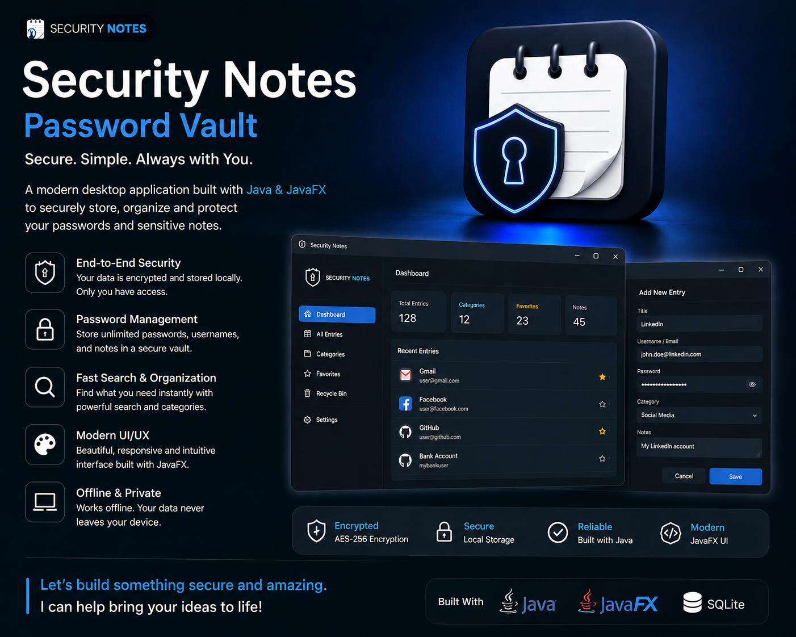

# Security Notes Password Vault



Security Notes is a modern Java and JavaFX desktop application for storing passwords, private notes, and sensitive information in an encrypted local vault.

The application is designed for offline use. Your data stays on your own computer and is protected by a master password.

## Download

The Windows installation `.exe` is included in this repository for download:

```text
dist/installer/PC Security Notes-1.0.5.exe
```

Download and run the installer to install Security Notes on Windows.

If Windows reports that another version is already installed, uninstall the previous `PC Security Notes` version from Windows Settings first, then run the latest installer again.

## Features

- Encrypted local password vault
- Master password protection
- Password entries and text notes
- Favorites for important entries
- Dark theme and light theme
- Auto-lock after inactivity
- Copy passwords safely from the app
- Local encrypted backup export and import
- Single-instance protection so the app opens only once
- Modern JavaFX desktop interface

## Security

Security Notes stores the encrypted vault locally at:

```text
%USERPROFILE%\.pc-security-notes\password-vault.dat
```

The vault uses AES-GCM encryption with PBKDF2 key derivation from the master password.

If you forget the master password, the stored notes and passwords cannot be recovered.

## Build From Source

The source code is private and is not included in this public repository.

## Author

Created by Dushko Stankovski.

GitHub: [ds-alt](https://github.com/ds-alt)
